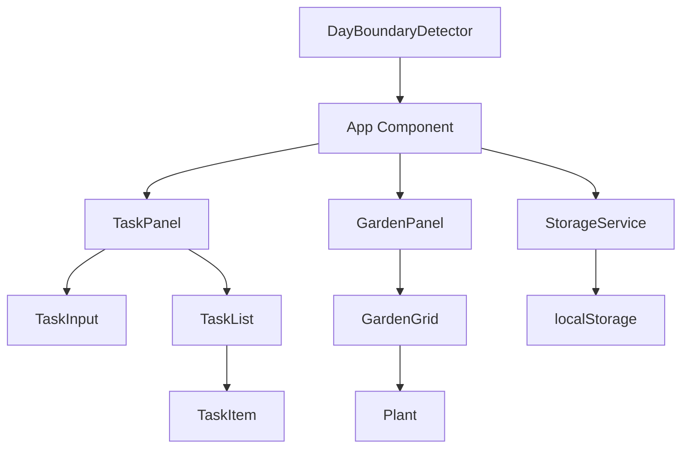
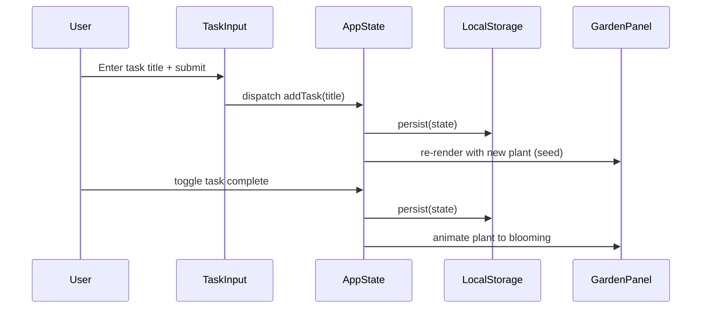

# Design Document: Bloomlist Garden

## Overview

Bloomlist is a single-page web application that gamifies daily task management through visual garden growth. Users create tasks for the current day, and each task is represented by a plant in a garden view. Completing a task triggers an animated growth sequence, transforming a seed into a blooming flower. The app persists state to local storage and resets daily at midnight.

### Technology Stack

- **Framework**: React 18+ with TypeScript
- **Build Tool**: Vite (fast dev server, optimized production builds)
- **Styling**: CSS Modules with CSS custom properties for theming
- **Animations**: CSS animations + `requestAnimationFrame` for growth sequences
- **Storage**: Browser localStorage API
- **Testing**: Vitest + React Testing Library + fast-check (property-based testing)
- **Package Manager**: npm

### Key Design Decisions

| Decision | Choice | Rationale |
|----------|--------|-----------|
| No backend | localStorage only | MVP scope, no auth needed, daily reset simplifies persistence |
| React | Component-based UI | Natural mapping of tasks → plants, reactive state updates |
| CSS animations | No animation library | Growth stages are simple enough; avoids extra dependency weight |
| Vite | Over CRA/Next | Lightweight, fast, no SSR needed for a client-only app |
| fast-check | PBT library | Mature, well-typed, good integration with Vitest |

## Architecture

The app follows a unidirectional data flow architecture with React state management.



### Data Flow



## Components and Interfaces

### Component Hierarchy

```
App
├── Header (title, date display, progress counter)
├── MainLayout (responsive container)
│   ├── TaskPanel
│   │   ├── TaskInput (form with validation)
│   │   └── TaskList
│   │       └── TaskItem[] (checkbox, title, delete button)
│   └── GardenPanel
│       ├── GardenGrid
│       │   └── Plant[] (animated growth stages)
│       └── CelebrationOverlay (confetti/particles on 100%)
└── StorageWarning (shown when localStorage unavailable)
```

### Core Interfaces

```typescript
// Types
type GrowthStage = 'seed' | 'sprout' | 'budding' | 'blooming';

interface Task {
  id: string;
  title: string;
  completed: boolean;
  createdAt: number; // timestamp for ordering
}

interface DayState {
  date: string; // ISO date string YYYY-MM-DD
  tasks: Task[];
}

// Component Props
interface TaskInputProps {
  onAddTask: (title: string) => void;
  taskCount: number;
  maxTasks: number;
}

interface TaskItemProps {
  task: Task;
  onToggle: (id: string) => void;
  onDelete: (id: string) => void;
}

interface PlantProps {
  growthStage: GrowthStage;
  isAnimating: boolean;
  onAnimationComplete: () => void;
}

interface GardenPanelProps {
  tasks: Task[];
  allComplete: boolean;
}
```

### Service Interfaces

```typescript
// Storage Service
interface StorageService {
  save(state: DayState): StorageResult;
  load(date: string): DayState | null;
  isAvailable(): boolean;
}

type StorageResult = 
  | { success: true }
  | { success: false; error: 'unavailable' | 'quota_exceeded' | 'write_error' };

// Day Boundary Service  
interface DayBoundaryService {
  getCurrentDate(): string; // YYYY-MM-DD in local time
  onDayChange(callback: () => void): () => void; // returns cleanup fn
}
```

### State Management

The app uses a React `useReducer` hook for predictable state transitions:

```typescript
type TaskAction =
  | { type: 'ADD_TASK'; title: string }
  | { type: 'TOGGLE_TASK'; id: string }
  | { type: 'DELETE_TASK'; id: string }
  | { type: 'LOAD_STATE'; state: DayState }
  | { type: 'RESET_DAY' };

function taskReducer(state: DayState, action: TaskAction): DayState;
```

## Data Models

### Task Model

| Field | Type | Constraints |
|-------|------|-------------|
| id | string (UUID) | Unique, auto-generated |
| title | string | 1-150 chars, trimmed, non-whitespace-only |
| completed | boolean | Default: false |
| createdAt | number | Unix timestamp ms, used for ordering |

### DayState Model

| Field | Type | Constraints |
|-------|------|-------------|
| date | string | ISO format YYYY-MM-DD, local timezone |
| tasks | Task[] | 0-20 items, ordered by createdAt |

### localStorage Schema

- **Key**: `bloomlist_day_{YYYY-MM-DD}`
- **Value**: JSON-serialized `DayState`
- **Cleanup**: Previous days' data is not actively cleaned (out of scope for MVP, but could be added later)

### Validation Rules

| Rule | Constraint |
|------|-----------|
| Task title min length | 1 character (after trim) |
| Task title max length | 150 characters |
| Max tasks per day | 20 |
| Title whitespace | Trimmed before validation; whitespace-only rejected |


## Correctness Properties

*A property is a characteristic or behavior that should hold true across all valid executions of a system—essentially, a formal statement about what the system should do. Properties serve as the bridge between human-readable specifications and machine-verifiable correctness guarantees.*

### Property 1: Valid task addition grows the list

*For any* valid task title (non-empty, non-whitespace-only, 1–150 characters) and any current DayState with fewer than 20 tasks, dispatching an ADD_TASK action shall result in a new state where the task list length has increased by exactly one and the last task's title equals the submitted title (trimmed).

**Validates: Requirements 1.1**

### Property 2: Whitespace-only titles are rejected

*For any* string composed entirely of whitespace characters (including the empty string), dispatching an ADD_TASK action shall leave the DayState unchanged—same task list length, same task contents.

**Validates: Requirements 1.4**

### Property 3: Task list ordering invariant

*For any* DayState produced by any sequence of valid actions (ADD_TASK, TOGGLE_TASK, DELETE_TASK), the tasks array shall be sorted in non-decreasing order by their createdAt timestamp.

**Validates: Requirements 1.2**

### Property 4: Maximum 20 tasks invariant

*For any* sequence of actions applied to an initially empty DayState, the task list length shall never exceed 20.

**Validates: Requirements 1.6, 1.7**

### Property 5: Plant count equals task count

*For any* DayState, the number of plants rendered in the garden shall always equal the number of tasks in the task list.

**Validates: Requirements 1.3, 3.2, 6.4**

### Property 6: Growth stage determined by completion state

*For any* task in a DayState, the derived growth stage for its corresponding plant shall be 'blooming' if the task is completed, and 'seed' if the task is incomplete.

**Validates: Requirements 2.2, 2.3, 3.3**

### Property 7: Progress counter derivation

*For any* DayState, the computed progress count shall equal the number of tasks where `completed === true`, and the total shall equal the task list length.

**Validates: Requirements 2.4, 6.5**

### Property 8: Celebration condition

*For any* DayState where the task list is non-empty and every task is completed, the celebration condition shall be true. For any DayState where the task list is empty or at least one task is incomplete, the celebration condition shall be false.

**Validates: Requirements 3.5, 3.6**

### Property 9: Task deletion removes exactly the target

*For any* DayState with at least one task, deleting a task by its ID shall result in a new state where the list length has decreased by exactly one, the deleted task's ID is absent from the list, and all other tasks remain unchanged in their original order.

**Validates: Requirements 6.3**

### Property 10: Day state isolation

*For any* two distinct date strings, saving state for one date and loading state for the other date shall return either null or a completely independent state—never the first date's data.

**Validates: Requirements 5.1, 5.2, 5.3**

### Property 11: Serialization round-trip

*For any* valid DayState object, serializing it to localStorage and then deserializing it shall produce a DayState that is deeply equal to the original.

**Validates: Requirements 7.1, 7.2**

### Property 12: Corrupt storage graceful handling

*For any* string that is not a valid JSON serialization of a DayState (including random bytes, partial JSON, and structurally invalid objects), the load function shall return null without throwing an exception.

**Validates: Requirements 7.5**

## Error Handling

### Storage Errors

| Scenario | Behavior |
|----------|----------|
| localStorage unavailable | Show persistent warning banner; app continues in memory-only mode |
| Quota exceeded on write | Show warning; keep in-memory state; retry on next operation |
| Corrupted data on load | Discard invalid data; start with empty state; log warning to console |
| JSON parse failure | Catch error; return null; display empty state |

### Validation Errors

| Scenario | Behavior |
|----------|----------|
| Empty/whitespace title | Show inline validation message below input; do not add task |
| Title exceeds 150 chars | `maxLength` attribute prevents input; no error message needed |
| 20-task limit reached | Show inline message; disable input; re-enable on task deletion |

### Animation Errors

| Scenario | Behavior |
|----------|----------|
| State change during animation | Cancel current animation via state flag; apply final state immediately |
| Browser doesn't support CSS animations | Plants show final state without transition (progressive enhancement) |

### Runtime Errors

- All reducer actions are pure and cannot throw (invalid actions are no-ops)
- Component error boundaries catch rendering errors and display fallback UI
- Day boundary detection uses `setInterval` with fallback to checking on user interaction

## Testing Strategy

### Unit Tests (Vitest + React Testing Library)

- **TaskInput component**: renders correctly, handles submit, shows validation errors
- **TaskItem component**: renders task, handles toggle/delete clicks, shows confirmation
- **Plant component**: renders correct growth stage visuals, applies animation classes
- **GardenPanel component**: renders correct number of plants, shows celebration
- **Responsive layout**: correct layout at different viewport widths
- **Day boundary detection**: detects midnight crossing, triggers reset
- **Storage error handling**: graceful degradation when localStorage unavailable

### Property-Based Tests (Vitest + fast-check)

Property-based testing library: **fast-check** (TypeScript-native, integrates with Vitest)

Configuration:
- Minimum 100 iterations per property test
- Each test tagged with design property reference

Properties to implement:
1. `taskReducer` — valid addition grows list (Property 1)
2. `taskReducer` — whitespace rejection (Property 2)
3. `taskReducer` — ordering invariant (Property 3)
4. `taskReducer` — max 20 invariant (Property 4)
5. `getPlantCount` — equals task count (Property 5)
6. `getGrowthStage` — determined by completion (Property 6)
7. `getProgress` — counter derivation (Property 7)
8. `getCelebration` — condition logic (Property 8)
9. `taskReducer` — deletion removes target only (Property 9)
10. `StorageService` — day isolation (Property 10)
11. `StorageService` — round-trip (Property 11)
12. `StorageService` — corrupt data handling (Property 12)

Tag format: `// Feature: bloomlist-garden, Property {N}: {title}`

### Integration Tests

- Full task lifecycle: create → complete → verify garden → delete
- Day reset flow: create tasks → simulate midnight → verify fresh state
- Storage round-trip with real localStorage mock
- Responsive layout transitions at breakpoint

### Accessibility Tests

- All interactive elements have accessible names
- Completion state perceivable without color
- Focus management after task actions
- Touch targets meet 44x44px minimum
