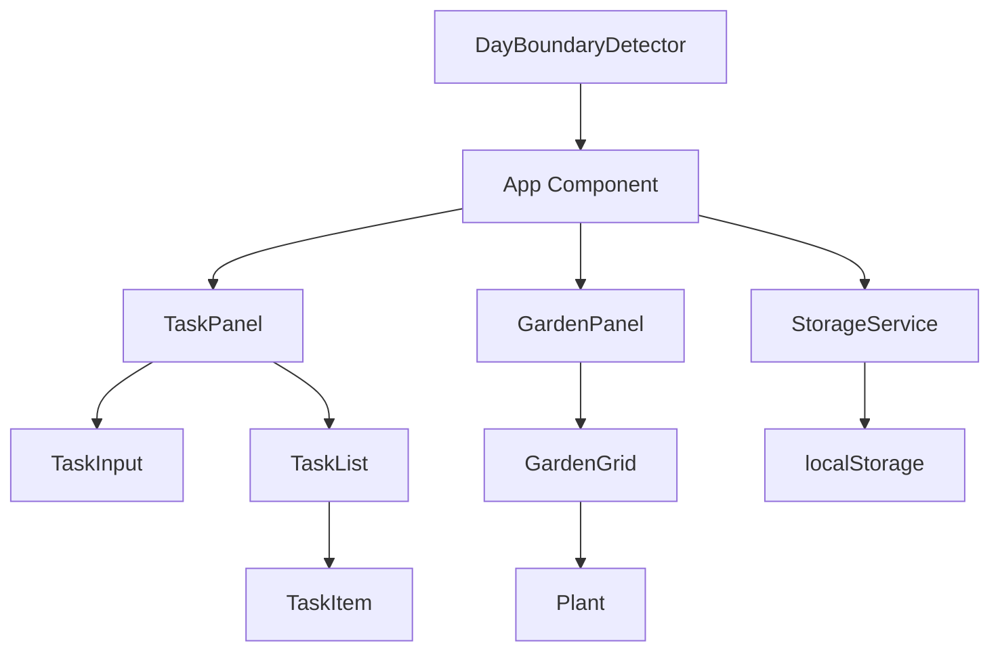
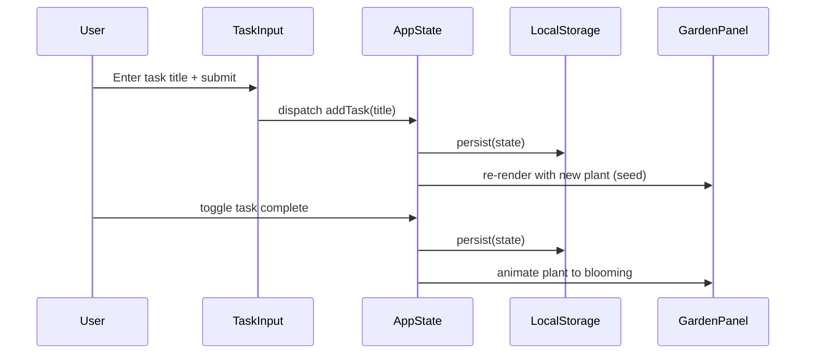

# Design Document: Bloomlist Garden

## Overview

Bloomlist is a single-page web application that gamifies daily task management through visual garden growth. Users create tasks for the current day, and each task is represented by a plant in a garden view. Completing a task triggers an animated growth sequence, transforming a seed into a blooming flower. The app persists state to local storage and resets daily at midnight.

### Technology Stack

- **Framework**: React 18+ with TypeScript
- **Build Tool**: Vite (fast dev server, optimized production builds)
- **Styling**: CSS Modules with CSS custom properties for theming
- **Animations**: CSS animations + `requestAnimationFrame` for growth sequences
- **Storage**: Browser localStorage API
- **Testing**: Vitest + React Testing Library + fast-check (property-based testing)
- **Package Manager**: npm

### Key Design Decisions

| Decision | Choice | Rationale |
|----------|--------|-----------|
| No backend | localStorage only | MVP scope, no auth needed, daily reset simplifies persistence |
| React | Component-based UI | Natural mapping of tasks → plants, reactive state updates |
| CSS animations | No animation library | Growth stages are simple enough; avoids extra dependency weight |
| Vite | Over CRA/Next | Lightweight, fast, no SSR needed for a client-only app |
| fast-check | PBT library | Mature, well-typed, good integration with Vitest |

## Architecture

The app follows a unidirectional data flow architecture with React state management.



### Data Flow



## Components and Interfaces

### Component Hierarchy

```
App
├── Header (title, date display, progress counter)
├── MainLayout (responsive container)
│   ├── TaskPanel
│   │   ├── TaskInput (form with validation)
│   │   └── TaskList
│   │       └── TaskItem[] (checkbox, title, delete button)
│   └── GardenPanel
│       ├── GardenGrid
│       │   └── Plant[] (animated growth stages)
│       └── CelebrationOverlay (confetti/particles on 100%)
└── StorageWarning (shown when localStorage unavailable)
```

### Core Interfaces

```typescript
// Types
type GrowthStage = 'seed' | 'sprout' | 'budding' | 'blooming';

interface Task {
  id: string;
  title: string;
  completed: boolean;
  createdAt: number; // timestamp for ordering
}

interface DayState {
  date: string; // ISO date string YYYY-MM-DD
  tasks: Task[];
}

// Component Props
interface TaskInputProps {
  onAddTask: (title: string) => void;
  taskCount: number;
  maxTasks: number;
}

interface TaskItemProps {
  task: Task;
  onToggle: (id: string) => void;
  onDelete: (id: string) => void;
}

interface PlantProps {
  growthStage: GrowthStage;
  isAnimating: boolean;
  onAnimationComplete: () => void;
}

interface GardenPanelProps {
  tasks: Task[];
  allComplete: boolean;
}
```

### Service Interfaces

```typescript
// Storage Service
interface StorageService {
  save(state: DayState): StorageResult;
  load(date: string): DayState | null;
  isAvailable(): boolean;
}

type StorageResult = 
  | { success: true }
  | { success: false; error: 'unavailable' | 'quota_exceeded' | 'write_error' };

// Day Boundary Service  
interface DayBoundaryService {
  getCurrentDate(): string; // YYYY-MM-DD in local time
  onDayChange(callback: () => void): () => void; // returns cleanup fn
}
```

### State Management

The app uses a React `useReducer` hook for predictable state transitions:

```typescript
type TaskAction =
  | { type: 'ADD_TASK'; title: string }
  | { type: 'TOGGLE_TASK'; id: string }
  | { type: 'DELETE_TASK'; id: string }
  | { type: 'LOAD_STATE'; state: DayState }
  | { type: 'RESET_DAY' };

function taskReducer(state: DayState, action: TaskAction): DayState;
```

## Data Models

### Task Model

| Field | Type | Constraints |
|-------|------|-------------|
| id | string (UUID) | Unique, auto-generated |
| title | string | 1-150 chars, trimmed, non-whitespace-only |
| completed | boolean | Default: false |
| createdAt | number | Unix timestamp ms, used for ordering |

### DayState Model

| Field | Type | Constraints |
|-------|------|-------------|
| date | string | ISO format YYYY-MM-DD, local timezone |
| tasks | Task[] | 0-20 items, ordered by createdAt |

### localStorage Schema

- **Key**: `bloomlist_day_{YYYY-MM-DD}`
- **Value**: JSON-serialized `DayState`
- **Cleanup**: Previous days' data is not actively cleaned (out of scope for MVP, but could be added later)

### Validation Rules

| Rule | Constraint |
|------|-----------|
| Task title min length | 1 character (after trim) |
| Task title max length | 150 characters |
| Max tasks per day | 20 |
| Title whitespace | Trimmed before validation; whitespace-only rejected |

